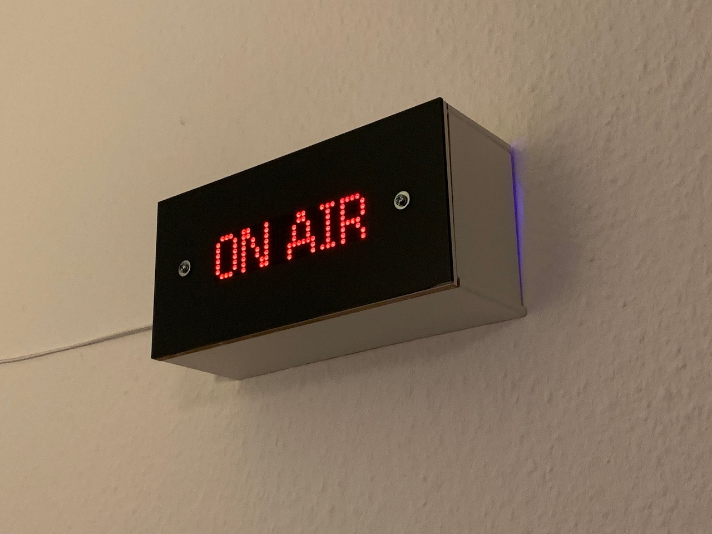
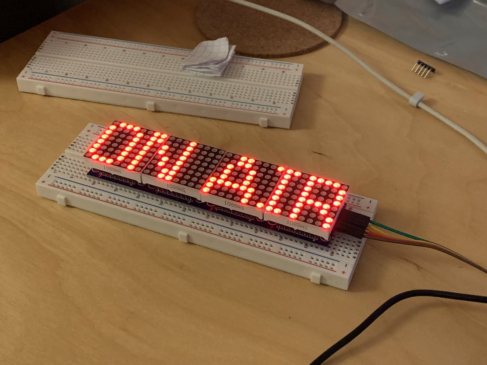
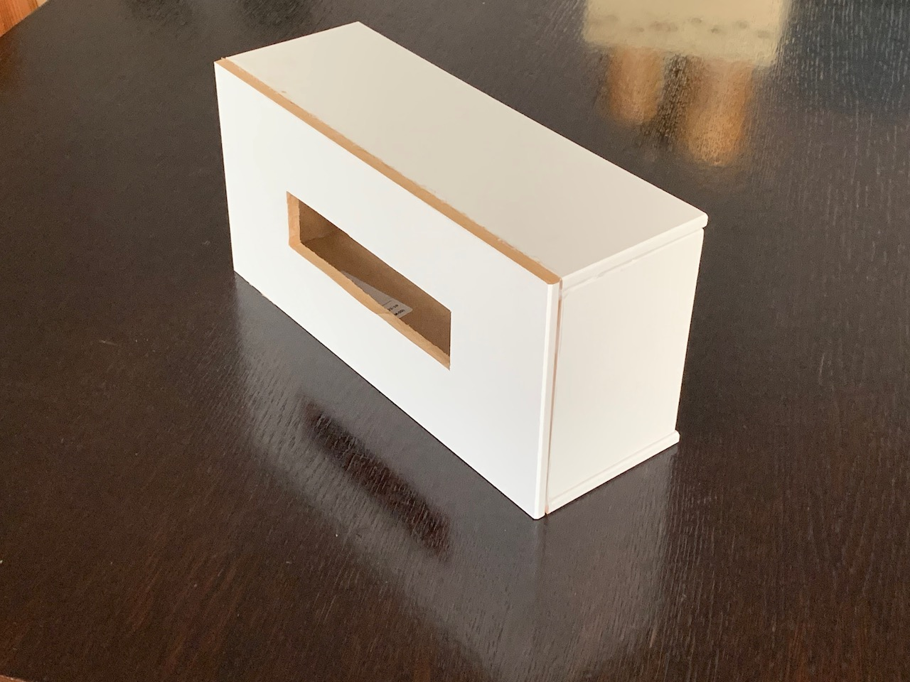
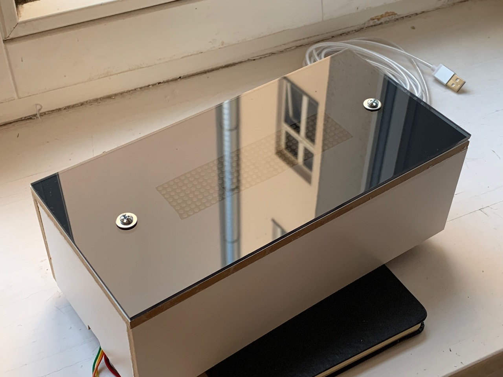
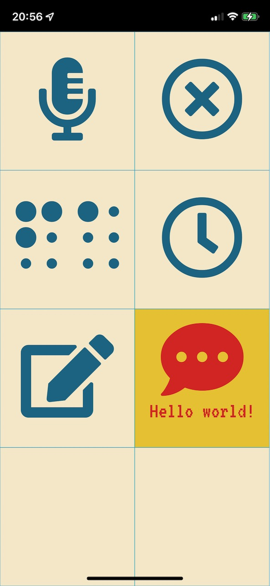

# on-air

I wanted an "On Air" sign that would show up behind me while I'm in a video call at work.

Since I work from home in the living room, this is a useful indicator to my wife that I'm in a meeting (even if muted and just listening). It's also something fun that shows up behind me while in a call and gets many nice compliments!

# Goals for the project
 * "On Air" status must be triggered automatically when Zoom calls begin or end
 * Learn some basic woodworking skills
 * Make the finished product look minimal and stylish
 * Learn how to use an RTC (Real-time clock) module
 * Include multiple modes so the project can be interacted with

## Materials required
Electronics:
* [NodeMCU v3 ESP8266](https://www.amazon.de/-/en/gp/product/B074Q2WM1Y/ref=ppx_yo_dt_b_search_asin_title?ie=UTF8&psc=1) microcontroller board
* 8x32 [LED matrix](https://www.amazon.de/-/en/gp/product/B079HVW652/ref=ppx_yo_dt_b_search_asin_title?ie=UTF8&psc=1)
* DS3231 [Real-time clock module](https://www.amazon.de/-/en/gp/product/B077XN4LL4/ref=ppx_yo_dt_b_search_asin_title?ie=UTF8&psc=1)
* Cables
* Breadboard
* A long [USB cable](https://www.amazon.de/-/en/gp/product/B01NCJHEHJ/ref=ppx_yo_dt_b_search_asin_title?ie=UTF8&psc=1)

Case:
* 5mm [darkened perspex / acrylic](https://www.amazon.de/-/en/gp/product/B0856148X9/ref=ppx_yo_dt_b_search_asin_title?ie=UTF8&psc=1)
* Nuts and bolts
* 7mm MDF board (sourced from leftover IKEA shelving)

Tools:
* Jigsaw
* [Clamps](https://www.amazon.de/gp/product/B0875RW1Y6/ref=ppx_yo_dt_b_asin_title_o02_s00?ie=UTF8&psc=1)
* [Wood glue](https://www.amazon.de/gp/product/B0012FBQ0U/ref=ppx_yo_dt_b_asin_title_o03_s00?ie=UTF8&psc=1)
* [Jigsaw table](https://www.amazon.de/gp/product/B0011KXNC0/ref=ppx_yo_dt_b_asin_title_o04_s00?ie=UTF8&psc=1)
* Drill

## Design, build and test
Prototyping the electronics came first, as usual. I hadn't worked with a large LED pixel array before, so this was the first thing I wanted to get right. With the `LedControl` library this is actually quite easy!

I was inspired by [this design](http://www.tjstephens.com/blog/2016/05/16/led-matrix-display/) which took an old wine box and converted it into an 8x64 LED display.

Beyond the cliché "ON AIR" message, I also wanted a couple of other modes to be available. As this is a wall piece that'll be visible from the whole room, a clock mode seemed obvious. That meant testing out the DS3231 RTC module. It turns out (!) that lots of DS3231 modules available online ship with a flaw that puts the battery at risk of overcharging and possible explosion. However, [desoldering a resistor](https://forum.arduino.cc/t/zs-042-ds3231-rtc-module/268862/70) will safely avoid this risk.

### Building the case
The case is made from pieces of 7mm MDF that were "upcycled" from leftover IKEA shelving. Each piece was measured and drawn out, then cut with a household jigsaw tool. Videos [like this](https://www.youtube.com/watch?v=jWneDzqAbH8) were really helpful for me to know how where to get started with it.

After cutting the pieces, and cutting out the front slot for the LED's, I applied wood glue and clamped the sides together. Some heavy weight from above helped to keep the sides stuck on to the front. I left the glue to cure for about 24 hours.

Next, I checked that the LED's fit correctly and snugly into the front slot. They did!

The acrylic front cover came with protective plastic on both sides. Leaving this on, I carefully drilled through the acrylic to leave a clean cut on both sides. Separately I drilled through the front cover in the same location. After confirming the alignment, I removed the acrylic's protective cover and bolted it to the case, with some washers to distribute the force a little better. It's a snug fit but doesn't need to be too tight.

todo stuff to mention
* put in an API section with swagger and link to it

## Zoom integration
Originally I wanted to use Zoom's webhook API to send messages to a gateway API, and then pass these on to the on-air sign. However, it turned out to be easier to use the fantastic [pyzoomproc](https://github.com/darrenpmeyer/pyzoomproc) utility, which runs on my work laptop and triggers [curl](https://github.com/curl/curl) to hit the appropriate endpoints on my sign.

## Remote control webapp
I based the design for the remote control application on the one I made for my [traffic light](https://github.com/skhg/traffic-light-controller/). It's pure JS/CSS with the only external dependency on [FontAwesome](https://fontawesome.com/) for icons.

It's hosted on GitHub pages so all the on-air sign has to do is proxy the initial request to load `index.html`

Updates to the sign state are shared via Websocket to all connected clients. Requests to change state are provided by the REST endpoints mentioned above.

## Next steps and improvements
Some feature requests i've heard already:
* Customisable, scrolling text
* A falling snow animation

## References and helpful tools
https://www.pixilart.com/draw#